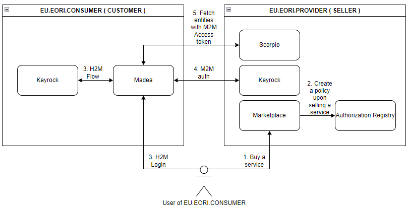
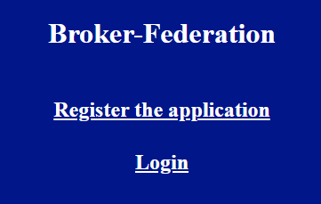
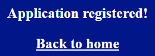
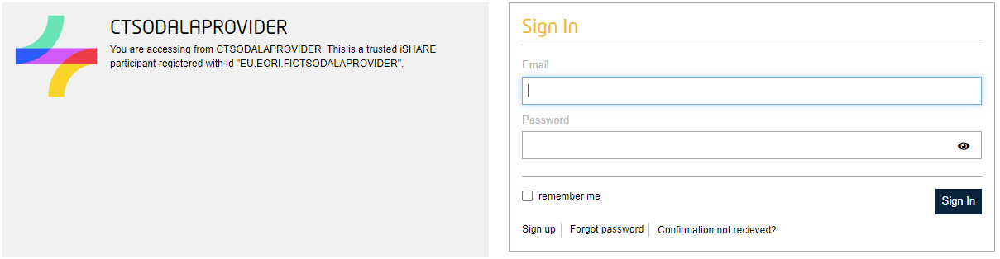
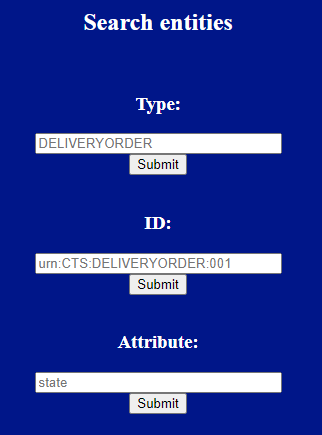

# 1. Trusted Marketplace


## 1.2 Trusted Marketplace and Authentication & Authorization

We have implemented i4Trust's authorization and identification scheme on top of the Scorpio. This way the data owners have control over who can access what data, and this paves the way towards being Data Spaces and GAIA-X compatible.



# 2 Trusted Marketplace demo application

To demonstrate the functionality of the solutions, we have deployed a [demo application](https://trusted-marketplace-portal.staging.odala.kiel.de/) which is deployed to Kiel. 


## 2.1 What this application do exactly?



This application is used to fetch entities and authenticate & authorize user with Keyrock IDM's OAuth2 i4trust functions and iSHARE policies.

The application is simple but secure due to backend/frontend scheme. The backend server handles authentication & authorization functions while frontend is used to login and search entities from Scorpio brokers.


## 3.1. Application functions

### 3.1.1. Registering application into Keyrock IDM

Registering application is made in application's /auth path. When /auth is requested, backend server posts a request into Keyrock IDM with JSON which contains needed information for registering into Keyrock IDM.

```
{
     'response_type':'code',
     'client_id': provider_client_id,
     'redirect_uri': keyrock_redirect_url,
     'scope': 'iSHARE',
     'request': make_jwt()
}
```



If registering the application was succesful, Keyrock redirects into application and user is greeted with "Applicaton registered!" message.

### 3.1.2. Login into application

In the index page (/), backend server creates an unique link for Keyrock IDM with different parameters:

```
{
    'response_type': 'code',
    'client_id': provider_client_id, 
    'scope': 'openid ishare',
    'redirect_uri': keyrock_redirect_url, 
    'state': 'F3D3rat3DstAt3', 
    'nonce': gen_random()
}
```

Technically, it is a link to Keyrock IDM with parameters shown above.

User is greeted with Keyrock IDM login screen or if user has a session already, Keyrock IDM handles the request and redirects back into application with a header called code, which is used for obtaining access token.



When redirection is done, backend server makes another request into Keyrock IDM with JSON data:

```
{
    'grant_type': 'authorization_code',
    'client_id': provider_client_id,
    'client_assertion_type': 'urn:ietf:params:oauth:client-assertion-type:jwt-bearer',
    'client_assertion': make_jwt(),
    'redirect_uri': keyrock_redirect_url,
    'scope': 'iSHARE',
    'code': request.args.get('code')
}
```

JSON data above must match with information which was passed to Keyrock IDM earlier in registering application phase. 
Due to expiration of code (30 seconds), it is ideal to let backend server to request an access token from Keyrock IDM.

If login & redirection was succesful, user is now authenticated and logged into application.
Technically, backend server passes the access token into user's browser and application checks if there is an access token. This was made this way due to security reasons.


### 3.1.3. Search entities



When user is logged into application, user can now search entities with **type**/**attribute**/**identifier** forms. When user submits a form, backend server uses form as a data and requests entities from Scorpio brokers with that data and access token. The access token is hidden in same form so therefore the form contains user's defined input and access token.

Technically, request is sent to API-Umbrella which validates the access token and forwards the request for Scorpio broker. While validating the access token, API-Umbrella checks user's policies from iSHARE Satellite.

If access token and policy is valid, the application returns a list of JSON data into user's browser.

```
[
  {
    "id": "ngsi-ld:DELIVERYORDER:CTS001-fed-broker",
    "type": "DELIVERYORDER",
    "value": "CTS007-fed-broker"
  }
]
```


### 3.1.4. JWT token creation

**make_jwt()** function creates a JWT token for Keyrock IDM. The JWT token contains iSHARE related information that Keyrock IDM uses for iSHARE functions and validates application. 

```
{
        "jti": str(uuid.uuid4()),
        "iss": provider_client_id,
        "sub": provider_client_id,
        "aud": consumer_client_id,
        "email": email,
        "iat": datetime.now(),
        "nbf": datetime.now(),
        "exp": datetime.now() + timedelta(seconds=30),
        "response_type": "code",
        "redirect_uri": keyrock_redirect_url,
        "callback_url": keyrock_redirect_url,
        "client_id": provider_client_id,
        "scope": "openid iSHARE",
        "state": "F3D3rat3DstAt3",
        "nonce": gen_random(),
        "acr_values": "urn:http://eidas.europa.eu/LoA/NotNotified/high",
        "language": "en"
}, private_key, algorithm='RS256', headers={'x5c': authorize_x5c}
```

"redirect_uri" key must match the Trusted Marketplace application's url because Keyrock IDM uses it to redirect back into application.

"exp" key must be maximum of + 30 seconds 

### 3.1.5. M2M JWT token creation

**make_jwt_m2m()** function creates a JWT token for Keyrock IDM. The JWT token contains iSHARE related information that Keyrock IDM uses for iSHARE functions and validates application.

```
{
        "jti": str(uuid.uuid4()),
        "iss": provider_client_id_m2m,
        "sub": provider_client_id_m2m,
        "aud": [
            consumer_client_id_m2m,
            keyrock_token_url_m2m
        ],
        "iat": datetime.now(),
        "nbf": datetime.now(),
        "exp": datetime.now() + timedelta(seconds=30),
}, private_key, algorithm='RS256', headers={'x5c': authorize_x5c}
```

---
# 4. Configuring Trusted Marketplace

Since Trusted Marketplace is now containerized, it is easier to configure it for production.

## 4.1 Environment Variables

|Environment variable|Default value|Explanation|
|---|---|---|
|PROVIDER_CLIENT_ID|EU.EORI.PROVIDER|Provider's EU.EORI number|
|CONSUMER_CLIENT_ID|EU.EORI.CONSUMER|Consumer's EU.EORI number|
|PROVIDER_CLIENT_ID_M2M|EU.EORI.PROVIDER|Provider's EU.EORI number|
|CONSUMER_CLIENT_ID_M2M|EU.EORI.CONSUMER|Consumer's EU.EORI number|
|CONSUMER_EMAIL|johndoe@example.com  | Consumer's email address|
|KEYROCK_URL_M2M|http://127.0.0.1:3000|Provider's Keyrock instance URL|
|APP_URL|http://127.0.0.1:5000|Trusted Marketplace's instance URL|
|SCORPIO_URL|http://127.0.0.1:9090|Scorpio Context Broker URL <br> (Must be behind API-Management)|
|PRIVATE_KEY_FILE|private_key|Private key's file name|
|X5C_VALUE_FILE|x5c|X5C Value's file name|


---

These environment variables must be modified:

```
      - env:
        - name: PROVIDER_CLIENT_ID
          value: "EU.EORI.FICTSODALAPROVIDER"
        - name: CONSUMER_CLIENT_ID
          value: "EU.EORI.FICTSODALACONSUMER"
        - name: PROVIDER_CLIENT_ID_M2M
          value: "EU.EORI.FICTSODALAPROVIDER"
        - name: CONSUMER_CLIENT_ID_M2M
          value: "EU.EORI.FICTSODALACONSUMER"
        - name: CONSUMER_EMAIL
          value: "johndoe@example.fi"
        - name: KEYROCK_URL
          value: "https://accounts.DOMAIN.fi"
        - name: KEYROCK_URL_M2M
          value: "https://accounts.DOMAIN.de"
        - name: APP_URL
          value: "https://trusted-marketplace-portal.DOMAIN.fi"
        - name: SCORPIO_URL
          value: "https://scorpio.DOMAIN.fi"
        - name: PRIVATE_KEY_FILE
          value: "private_key"
        - name: X5C_VALUE_FILE
          value: "x5c"  
```

Make sure that secrets made in 3.1.3. correspond with variables **PRIVATE_KEY_FILE** & **X5C_VALUE_FILE** values:

--from-file=**private_key** --from-file=**x5c**:

* PRIVATE_KEY_FILE value: **private_key**
* X5C_VALUE_FILE value: **x5c**


## 4.2 Obtaining certificates from iSHARE

One set of iSHARE certificates are needed for Trusted Marketplace.

.pkcs12 file contains 3 certificates with private key. 

https://dev.ishare.eu/_downloads/54a7b056df8dcc44f1049a82824d56f8/181113iSHARE_Certificate_cheat_sheet_v1.pdf

Extract key & certificates from pkcs12
>openssl pkcs12 -info -in filename.p12 -nodes -nocerts

>openssl pkcs12 -in filename.p12 -out certificates.pem -nokeys

### 4.2.1 Private key

The extracted private key file should be fine for Trusted Marketplace.

Private key file must contain PEM contents with actual private key.

This private key is used to create a JWT token.

### 4.2.2 X5C value

X5C value file is made from certificates.pem file. X5C value contains iSHARE related information.

X5C value file should contain 3 lines where certificates are put without BEGIN CERTIFICATE & END CERTIFICATE phrases: 

* 1. first line is first certificate from certificates.pem file without BEGIN and END lines: **MIIA**
* 2. second line is second certificate from certificates.pem file without BEGIN and END lines: **MIIB**
* 2. third line is third certificate from certificates.pem file without BEGIN and END lines: **MIIC**

If X5C value file has empty lines, make sure to delete them.

### 4.2.3 Secrets

Create secrets from private key and x5c value files.

>kubectl -n odala create secret generic ishare-keys --from-file=private_key --from-file=x5c

## 4.3 Building Docker image

Trusted Marketplace image is built with Dockerfile.
Trusted Marketplace image can be built with command:
>docker build -t trusted-marketplace-portal:latest .

## 4.4 .yaml file contents

The deployment .yaml is used to start the Trusted Marketplace in Kubernetes. .yaml file contains deployment, service and ingress rule.

>kubectl -n odala apply -f deployment.yaml

### 4.4.2 Mounting secrets

```
    spec:
      volumes:
      - name: ishare-keys
        secret:
          secretName: ishare-keys
```

```
        volumeMounts:
        - name: ishare-keys
          mountPath: "/keys/secrets/"
```

### 4.4.3 Ingress

```
apiVersion: networking.k8s.io/v1
kind: Ingress
metadata:
  annotations:
    cert-manager.io/cluster-issuer: letsencrypt-production
    kubernetes.io/ingress.class: nginx
  name: trusted-marketplace-app
  namespace: odala
spec:
  rules:
  - host: trusted-marketplace.DOMAIN.fi
    http:
      paths:
      - backend:
          service:
            name: trusted-marketplace-app
            port:
              number: 5000
        path: /
        pathType: Prefix
  tls:
  - hosts:
    - trusted-marketplace.DOMAIN.fi
    secretName: trusted-marketplace-cert
status:
  loadBalancer:
    ingress:
    - ip: 10.128.30.124
```


---
# 6 Contact 

We are here to help you! If you need any help, or just want to have a chat, please contact ilari.mikkonen@contrasec.fi

---

Components- Trusted Marketplace Portal

for the ODALA project.

© 2023 Contrasec Oy

License EUPL 1.2


The contents of this publication are the sole responsibility of the authors and do not necessarily reflect the opinion of the European Union.
This project has received funding from the European Union’s “The Connecting Europe Facility (CEF) in Telecom” programme under Grant Agreement number: INEA/CEF/ICT/A2019/2063604
